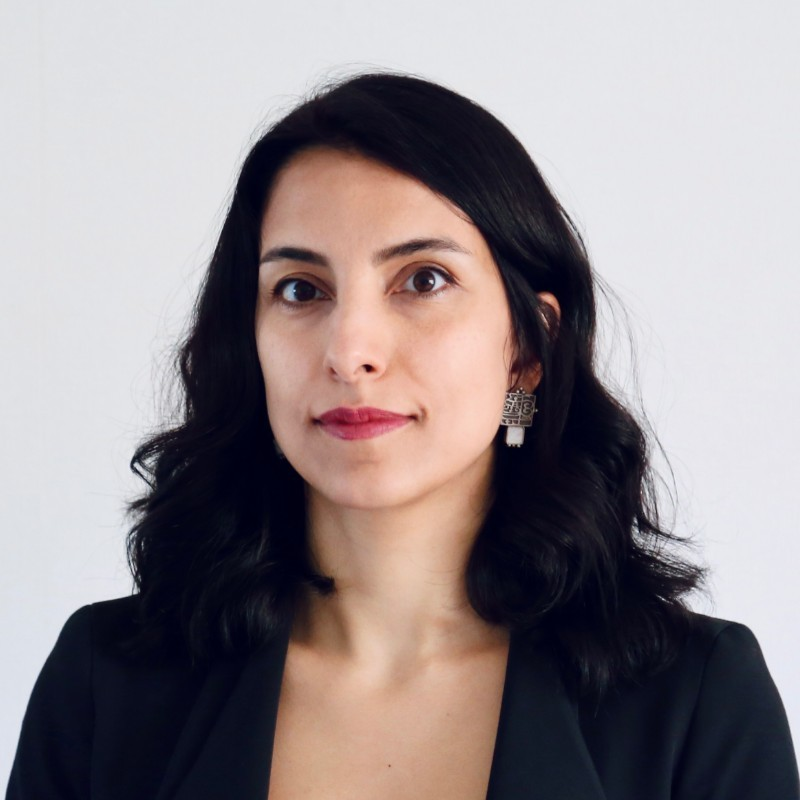
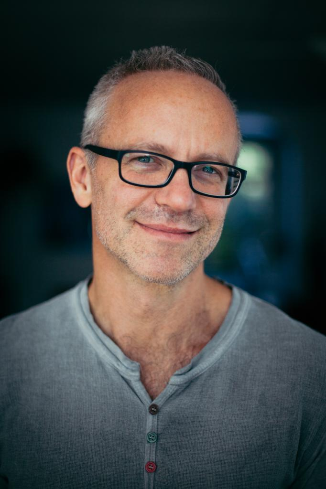
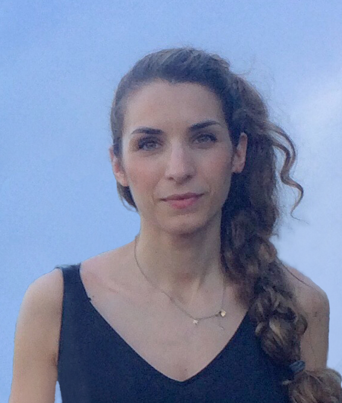
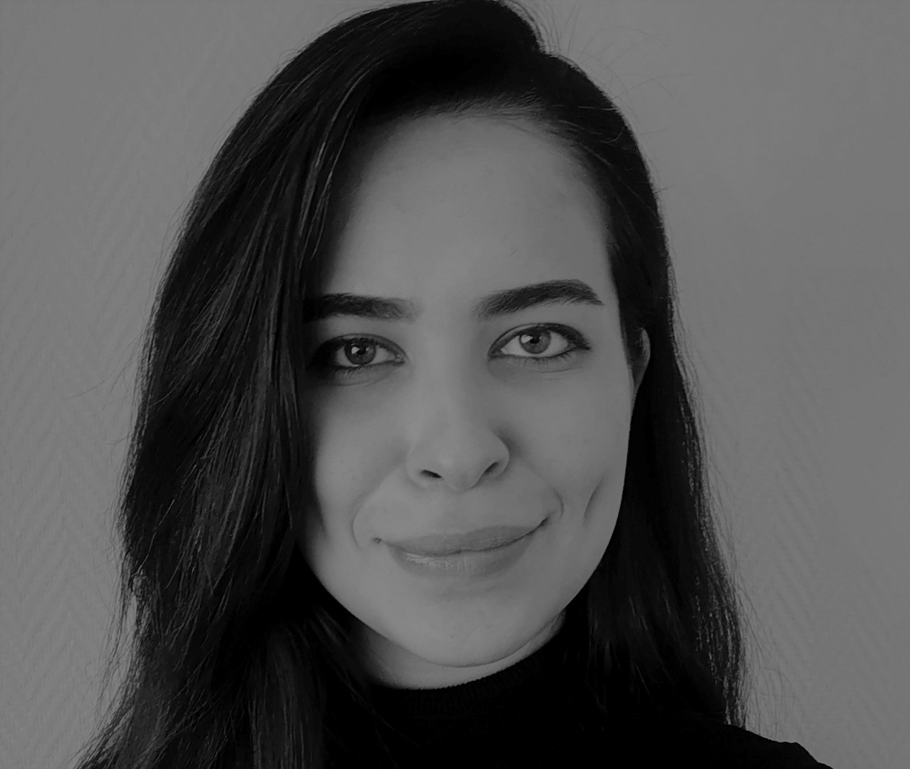
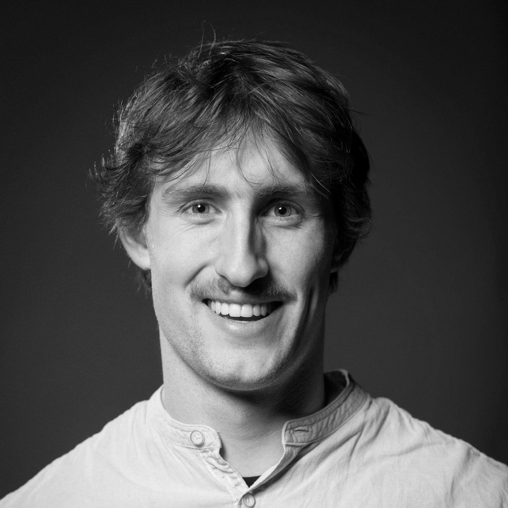

---
title:
feature_text: |
  # 1st Computer Vision Aided Architectural Design Workshop
feature_image: "assets/images/cover-image1.png"
---

<!---

--->

<!---color blue: #7382EF, dark green: #8DAB7F, light green: #CFEE9D, pink: #ff54b0, color dark blue: #1932E1 --->

Welcome to the first workshop on Computer Vision Aided Architectural Design (CVAAD). We are delighted that our workshop will be hosted at the [International Conference on Computer Vision](https://iccv2023.thecvf.com/) (ICCV), October 3, 2023.

<!---color
*CVAAD aims at strengthening the partnership of architectural design with that of computer vision, by more formally closing the loop between real-world problems in architectural design and tangible computer vision tasks as well as properly curated data. Establishing denser feedback between the two disciplines could have a profound effect on the trillion-dollar built-environment market and, more crucially, the overall quality of life worldwide.* --->

## About the workshop

The workshop aims at expanding the interdisciplinary domain of computer vision in architectural design, encouraging collaboration, and investigating common research interests. By showcasing datasets and applications from architectural design, this workshop creates opportunities for computer vision researchers. Through keynote talks, discussions, and a workshop challenge, attendees will explore relevant topics from both generative and analytic computer vision for the applications and processes in architectural design. This will shed light on the needs, constraints, and challenges associated with developing and implementing effective computer vision tasks and methods in architectural design and research. The workshop consists of the following:

- [Invited speakers](/keynotes/)
- [Paper submissions](/papers/)
- [Competition on floor plan auto-completion](/competition/)
- [Workshop schedule](/schedule/)

## Organization

    

        

              
              <h4><a href="https://www.tudelft.nl/ewi/over-de-faculteit/afdelingen/intelligent-systems/pattern-recognition-bioinformatics/computer-vision-lab/people/seyran-khademi">Seyran Khademi</a></h4>
              
Assist. Prof. at the faculty of Architecture and the Built Environment, Delft University of Technology

        

    

    

        

              
              <h4><a href="https://www.tudelft.nl/ewi/over-de-faculteit/afdelingen/intelligent-systems/pattern-recognition-bioinformatics/computer-vision-lab/people/jan-van-gemert">Jan van Gemert</a></h4>
              
Assoc. Prof. at the faculty of Electrical Engineering, Mathematics and Computer Science, Delft University of Technology

        

    

    

        

              
              <h4><a href="https://profiles.stanford.edu/iro-armeni?releaseVersion=10.5.2">Iro Armeni</a></h4>
              
Assist. Prof. at the department of Civil and Environmental Engineering, Stanford University

        

    

    

        

              
              <h4><a href="https://www.tudelft.nl/staff/f.mostafavi/?cHash=db57104f8776c2a1522b91c039845e84">Fatemeh Mostafavi</a></h4>
              
Doctoral candidate at the faculty of Architecture and the Built Environment, Delft University of Technology

        

    

      
      <h4><a href="https://www.tudelft.nl/staff/c.c.j.vanengelenburg/?cHash=a72f1da92639fa8301893a08d4b49da1">Casper van Engelenburg</a></h4>
      
Doctoral candidate at the faculty of Architecture and the Built Environment, Delft University of Technology

