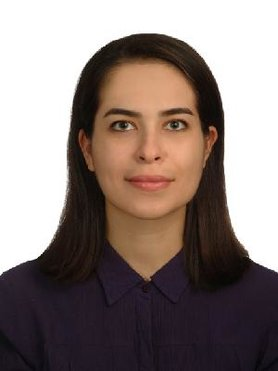

---
title:
feature_text: |
  # 1st Computer Vision Aided Architectural Design Workshop
feature_image: "assets/images/cover-image1.png"
---



<!---color blue: #7382EF, dark green: #8DAB7F, light green: #CFEE9D, pink: #ff54b0, color dark blue: #1932E1 --->

Welcome to the **first workshop** on Computer Vision Aided Architectural Design (CVAAD). We are delighted that our workshop will be hosted at the [International Conference on Computer Vision 2023](https://iccv2023.thecvf.com/) (ICCV).

*CVAAD aims at strengthening the partnership of architectural design with that of computer vision, by more formally closing the loop between real-world problems in architectural design and tangible computer vision tasks as well as properly curated data. Establishing denser feedback between the two disciplines could have a profound effect on the trillion-dollar built-environment market and, more crucially, the overall quality of life worldwide.*

## About the workshop

The workshop connects the domains of architectural design with that of computer vision by establishing a common ground of interaction and identifying shared research interests. Specifically, this workshop introduces novel data and applications, from the discipline of architectural design, to open new opportunities for researchers in computer vision. Specifically, the workshop consists of three parts:

- [Hybrid workshop](/schedule/)
- [Paper submissions](/papers/)
- [Competition on Floor Plan Auto-Completion](/competition/)

Through the keynote talks, discussions, and the workshop’s challenge, relevant topics will be presented to attendees from the dual lens of computer vision and architecture, highlighting the requirements, limitations, and bottlenecks related to developing and adopting robust and useful computer vision applications for architectural design and research practice.

## Organization

    

        

              
              <h4><a href="https://www.tudelft.nl/ewi/over-de-faculteit/afdelingen/intelligent-systems/pattern-recognition-bioinformatics/computer-vision-lab/people/seyran-khademi">Seyran Khademi</a></h4>
              
Assist. Prof. at the faculty of Architecture and the Built Environment, Delft University of Technology

        

    

    

        

              
              <h4><a href="https://www.tudelft.nl/ewi/over-de-faculteit/afdelingen/intelligent-systems/pattern-recognition-bioinformatics/computer-vision-lab/people/jan-van-gemert">Jan van Gemert</a></h4>
              
Assoc. Prof. at the faculty of Electrical Engineering, Mathematics and Computer Science, Delft University of Technology

        

    

    

        

              
              <h4><a href="https://profiles.stanford.edu/iro-armeni?releaseVersion=10.5.2">Iro Armeni</a></h4>
              
Assist. Prof. at the department of Civil and Environmental Engineering, Stanford University

        

    

    

        

              
              <h4><a href="https://www.tudelft.nl/staff/f.mostafavi/?cHash=db57104f8776c2a1522b91c039845e84">Fatemeh Mostafavi</a></h4>
              
Doctoral candidate at the faculty of Architecture and the Built Environment, Delft University of Technology

        

    

      
      <h4><a href="https://www.tudelft.nl/staff/c.c.j.vanengelenburg/?cHash=a72f1da92639fa8301893a08d4b49da1">Casper van Engelenburg</a></h4>
      
Doctoral candidate at the faculty of Architecture and the Built Environment, Delft University of Technology

